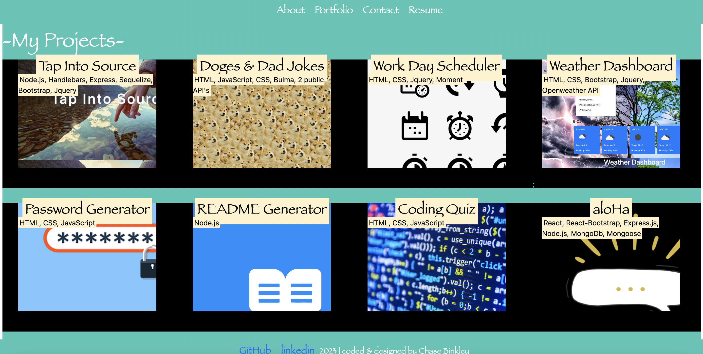

# React Portfolio

## Description

This application is my portfolio that was created using React. Users can toggle between my portfolio, about section, contact form, and resume downloader. Development is still underway. 

### Installation

- Clone the repository from GitHub
- Install node.js
- Run npm install to install dependencies.
- Run npm start to start the web server and connect

####

##### Links

[GitHub](https://github.com/chasebinkley/React-Portfolio)
[Deployed](can't deploy through heroku)

